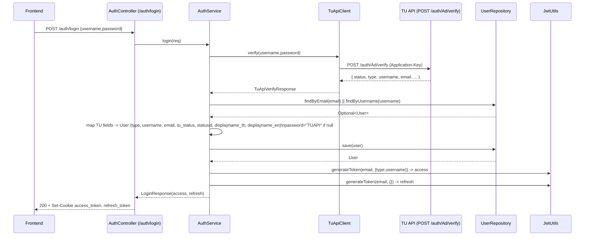
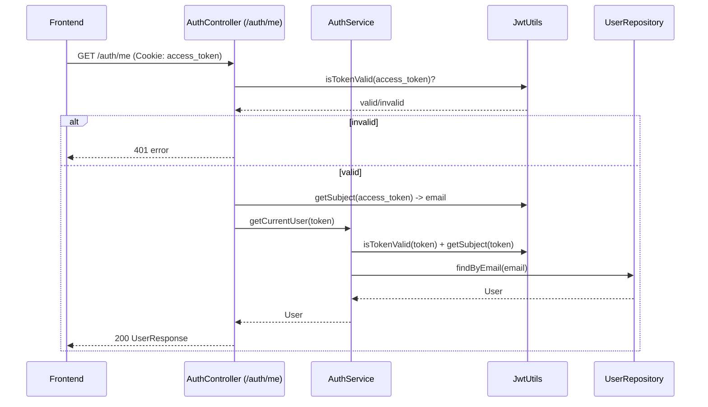
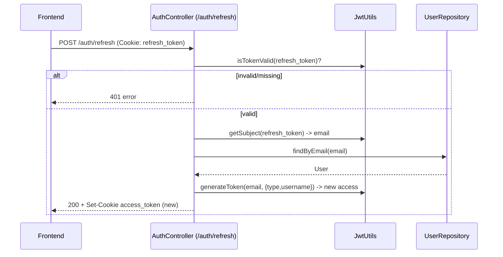
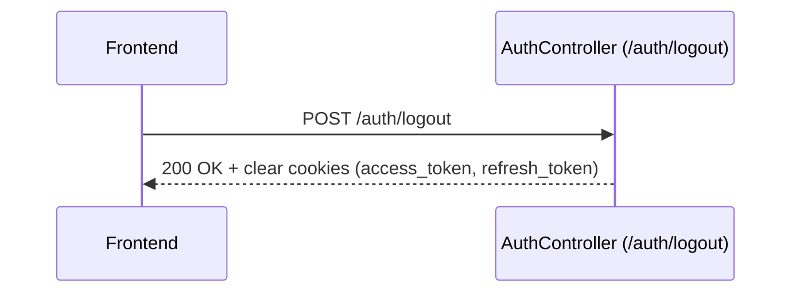

## TU_BookingSports Backend – Auth Overview

This backend integrates Thammasat University TUAPI for authentication. The app verifies user credentials with TUAPI, upserts the user profile into our `users` table, and issues HttpOnly JWT cookies for session handling.

### Endpoints
- `POST /auth/login` – Verify with TUAPI, set `access_token` and `refresh_token` cookies
- `GET /auth/me` – Return current user profile from `access_token`
- `POST /auth/refresh` – Issue new `access_token` from `refresh_token`
- `POST /auth/logout` – Clear both cookies
- `GET /health` – Health check (200 OK)

### Files
- Controller: `src/main/java/com/example/tu_bookingsports/controller/AuthController.java`
- Service: `src/main/java/com/example/tu_bookingsports/service/AuthService.java`
- TUAPI client: `src/main/java/com/example/tu_bookingsports/service/TuApiClient.java`
- JWT utils: `src/main/java/com/example/tu_bookingsports/config/JwtUtils.java`
- User entity: `src/main/java/com/example/tu_bookingsports/model/User.java`

---

## Sequence Diagrams

### Login


### Get Me


### Refresh Token


### Logout


---

## Configuration

### Environment (.env)
- `TUAPI_APPLICATION_KEY=` TUAPI Application-Key
- `DB_URL=` JDBC URL (SQL Server)
- `DB_USERNAME=`, `DB_PASSWORD=`
- `JWT_SECRET=` base64 or plain secret
- `JWT_EXPIRATION=` millis (e.g. 3600000)

### Properties
- `src/main/resources/application.properties`
  - `tuapi.base-url=https://restapi.tu.ac.th/api/v1/auth/Ad`
  - `tuapi.application-key=${TUAPI_APPLICATION_KEY:}`
  - `tuapi.insecure=true|false` (dev-only; bypass SSL validation to TUAPI)

### Database (Thai/Unicode)
- Ensure these columns are `NVARCHAR` in SQL Server:
  - `displayname_th`, `displayname_en`, `tu_status`
- Example migration:
```
ALTER TABLE dbo.users ALTER COLUMN displayname_th NVARCHAR(255) NULL;
ALTER TABLE dbo.users ALTER COLUMN displayname_en NVARCHAR(255) NULL;
ALTER TABLE dbo.users ALTER COLUMN tu_status NVARCHAR(255) NULL;
```

---

## Quick Test (Postman)
- POST `http://localhost:8081/auth/login` with `{ "username":"<tu_user>", "password":"<tu_pass>" }`
- GET `http://localhost:8081/auth/me` (cookies sent automatically)
- POST `http://localhost:8081/auth/refresh`
- POST `http://localhost:8081/auth/logout`
